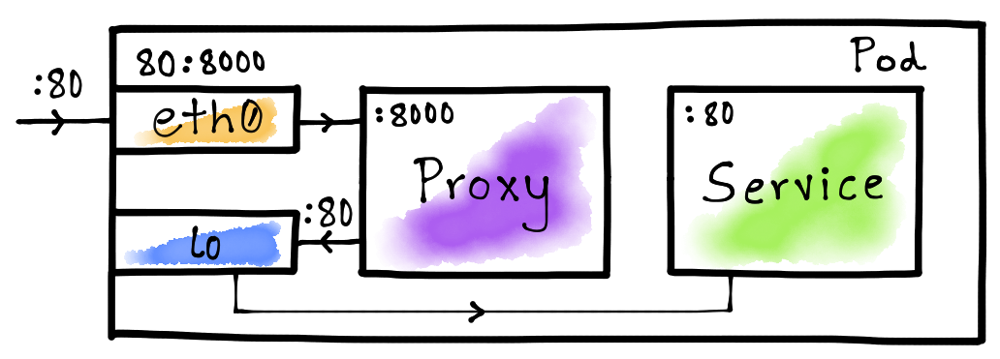

# AuthN/AuthZ using sidecar proxies on Kubernetes

This demo contains the following components:

- A resource server running on port 80
- A sidecar proxy running on port 8000, in the same pod as the resource-server

The sidecar proxy intercepts all calls to the resource server and runs authN/authZ checks against them. If incoming calls pass these checks, they are forwarded to the resource-server. Otherwise, a 403 Forbidden reply is sent back.

## References

- [Kubernetes - Pods - Resource sharing and communication](https://kubernetes.io/docs/concepts/workloads/pods/#resource-sharing-and-communication)
- [Kubernetes - Cluster Networking](https://kubernetes.io/docs/concepts/cluster-administration/networking/)
- [Implementing a reverse proxy server in Kubernetes using the sidecar](https://www.magalix.com/blog/implemeting-a-reverse-proxy-server-in-kubernetes-using-the-sidecar-pattern)
- [Hand-crafting a sidecar proxy and demystifying Istio](https://venilnoronha.io/hand-crafting-a-sidecar-proxy-and-demystifying-istio)
